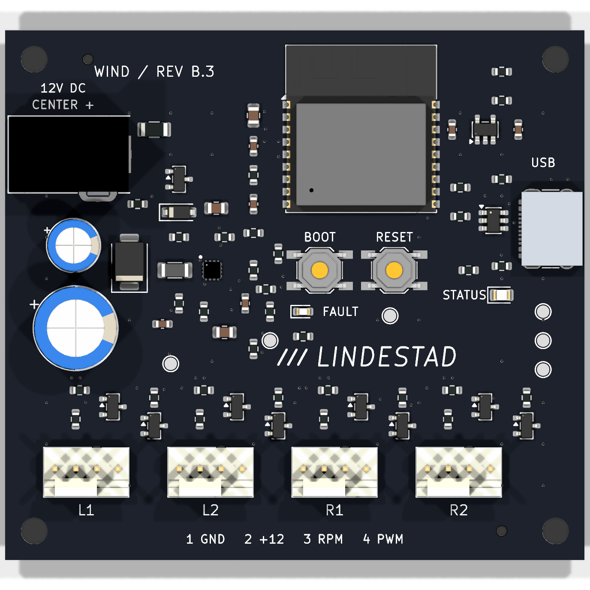
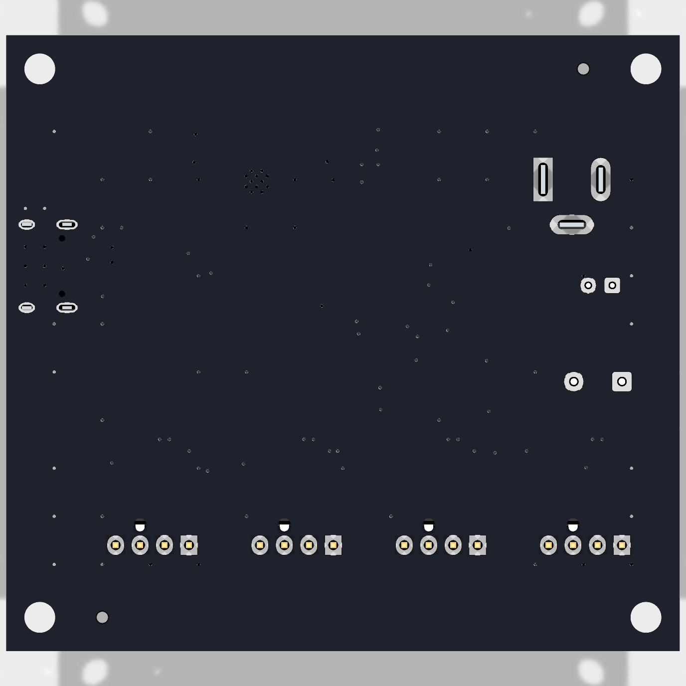

# WindPCB B.3 — editable hardware and manufacturing release

70 × 64 mm, black solder mask, white silkscreen, two-layer 1.6 mm FR-4 / 1 oz copper.
ESP32-C3-WROOM-02-N4; four ARCTIC P14 Pro PST headers; native USB-C; protected 12 V input.




These are CAD renders, not photographs. J1, J2 and U4 have representative visual bodies;
their manufacturer drawings and electrical pads govern assembly.

## Reproduce the board

1. Install **KiCad 10.0**, including its standard symbol, footprint and 3D libraries.
2. Open `windpcb.kicad_pro`. All project-specific symbols, footprints and visual models
   are under `libraries/`; library tables use `${KIPRJMOD}`. Standard STEP models use
   `${KICAD10_3DMODEL_DIR}`. No files from the author's KiCad folder are needed.
3. Use [BOM.csv](BOM.csv), [schematic PDF](reports/schematic.pdf) and
   [assembly drawing](reports/assembly-top.pdf) to inspect the release.
4. Fabrication input: [Gerber ZIP](manufacturing/windpcb-revb-gerbers.zip), including
   copper, masks, silkscreens, outline, separate PTH/NPTH drilling and front paste.
5. Full assembly inputs: [PCBA BOM](manufacturing/assembly/PCBA-BOM.csv) and
   [PCBA CPL](manufacturing/assembly/PCBA-CPL.csv): **70 placements, 33 MPNs,
   63 SMT + 7 through-hole**. Do not use the SMT-only files for full assembly.
6. Select black mask / white silk, lead-free HASL, top-side assembly, and customer-added
   tooling holes. Retain individual placement review. Firmware is flashed afterward.

J1 takes a **5.5 × 2.5 mm centre-positive 12 V** barrel plug. Use a regulated supply
with sufficient startup margin (at least 3 A recommended). Each fan has its own header;
leave PST daisy-chain sockets unused. Pin order: **1 GND, 2 +12 V, 3 tach, 4 PWM**.

## Placement and process review

The included CPL is the original submitted file, with explicit connector/capacitor
insertion-origin offsets. **JLC subsequently corrected several component orientations
in its own assembly system. The final numeric machine placement file was not supplied.**
This release therefore requires a fresh supplier placement review; uploading the CPL
alone does not reproduce that approval. Verify every polarized part/pin 1 against the
native CAD and assembly drawing, especially Q1–Q9, U2/U3/U4, J2–J6, D1–D4 and C6/C9.
The first assembled board has since operated successfully with the firmware.

U4 TPS25970LRPWR has ten electrical terminals, even when a supplier's generic visual
model shows sixteen leads. Its 16 split paste apertures are intentional. Preserve the
TI-derived RPW0010A lands and 0.100 mm stencil prescription; ask the assembler to review
the eFuse, USB-C, and ESP32 thermal-via soldering process for its selected finish.

H1–H4: 3.2 mm M3 mounting holes, 63 × 57 mm spacing. H5/H6 are 1.152 mm NPTH tooling
holes with 0.148 mm mask expansion. Their centres are (10, 3.5) and (60, 60.5) mm from
the upper-left corner. The CPL origin is the lower-left corner; X right, Y up.

## Regenerate and verify

Run the exporter with KiCad's Python (which provides `pcbnew`). On Windows:

```powershell
& 'C:/Program Files/KiCad/10.0/bin/python.exe' -m pip install --target hardware/tools/vendor -r hardware/tools/requirements.txt
& 'C:/Program Files/KiCad/10.0/bin/python.exe' hardware/tools/export.py
```

On another installation, put `kicad-cli` on PATH or set `KICAD_CLI` and use a Python
environment that can import KiCad 10's `pcbnew`. The exporter runs ERC, full DRC with
schematic parity, checks every pad/net, exports manufacturing files/BOM/CPL, PDFs,
board-only STEP, pictures and SHA256 hashes. It does **not** rebuild or reroute the PCB.
Historical one-time layout generators were deliberately not included as build steps.

Engineering specifications and revision notes are in `docs/`. Their pre-order wording
and references to historical local reports describe earlier reviews, not the current
hardware test status. The root README and `docs/validation.md` describe current tests.
Private supplier order/account records are not part of this public release.

Sources: [TI TPS2597](https://www.ti.com/lit/ds/symlink/tps2597.pdf),
[ARCTIC P14 Pro PST](https://support.arctic.de/p14-pro-pst),
[JLC tooling guide](https://jlcpcb.com/help/article/how-to-add-tooling-holes-for-pcb-assembly-order).
